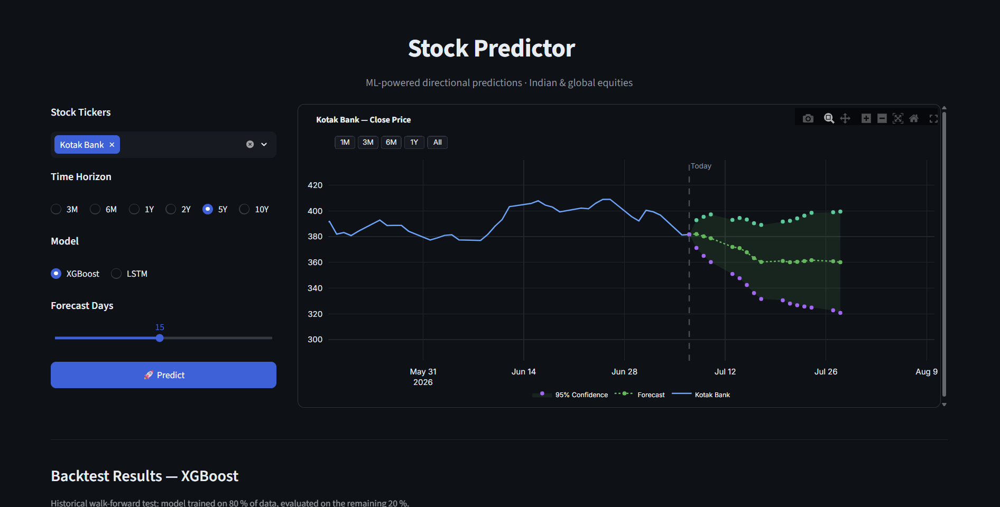
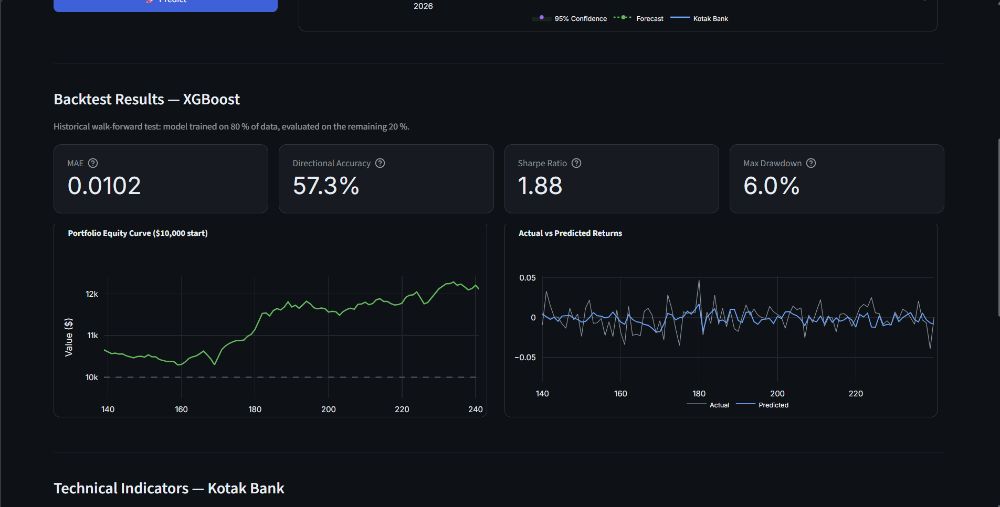
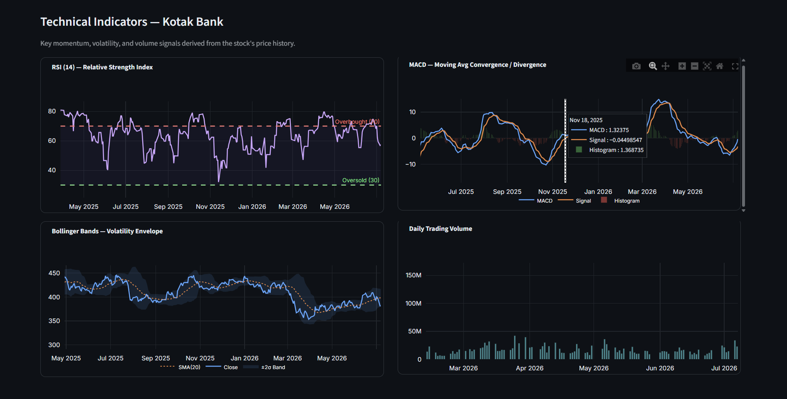
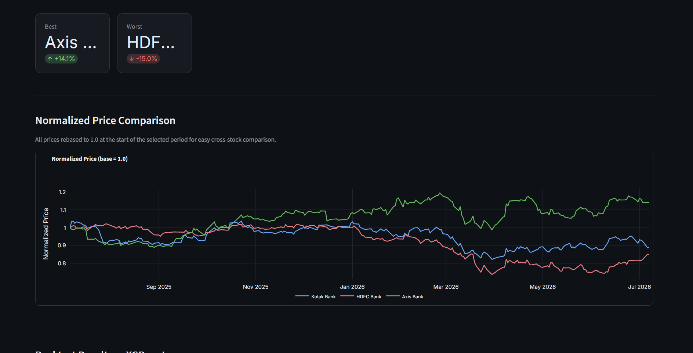

# Stock Predictor

An experimental stock forecasting project built around historical market data, engineered features, and two model families: XGBoost and an LSTM network. The repository includes a Streamlit dashboard for interactive exploration, a FastAPI service for programmatic access, and a small model versioning utility for saved artifacts.

## What It Does

The project pulls OHLCV data from Yahoo Finance, builds time-series features such as lag values, rolling means, RSI, MACD, Bollinger band width, and volume change, then trains models to predict next-period returns or direction.

It currently supports:

- Historical data loading through `yfinance`
- Feature engineering for price, momentum, trend, and volatility signals
- XGBoost and LSTM training workflows
- Simple walk-forward backtesting with Sharpe ratio and max drawdown reporting
- Streamlit visualization for forecasts and analysis
- FastAPI endpoints for health checks, feature inspection, and prediction requests
- Model artifact saving with lightweight metadata in `models/`

## Screenshots

These images show the current Streamlit dashboard flow and are included here for quick reference.

### Forecast View



### Backtest Results



### Technical Indicators



### Normalized Price Comparison



## Project Structure

```
.
├── main.py
├── streamlit_app.py
├── stock_api.py
├── lstmPractice.ipynb
├── models/
│   ├── LSTMv1_meta.json
│   ├── LSTMv1.pt
│   └── XGBv1_meta.json
└── src/
    ├── api/
    │   └── routes.py
    ├── data/
    │   ├── loader.py
    │   ├── preprocessor.py
    │   └── splitter.py
    ├── models/
    │   ├── backtester.py
    │   ├── lstm_model.py
    │   ├── trainer.py
    │   └── versioner.py
    └── utils/
        └── logger.py
```

## Installation

1. Clone the repository.
2. Create and activate a virtual environment.
3. Install the required packages.

Example on Windows:

```bash
git clone <repository-url>
cd stock_predictor
python -m venv .venv
.venv\Scripts\activate
pip install -U pip
pip install fastapi uvicorn yfinance numpy pandas scikit-learn xgboost torch matplotlib seaborn plotly streamlit statsmodels joblib
```

If you prefer, add those dependencies to `requirements.txt` and install from there.

## Running The Apps

### Streamlit Dashboard

Run the interactive dashboard with:

```bash
streamlit run streamlit_app.py
```

This is the main user-facing app. It lets you choose a ticker, load market data, generate forecasts, and compare model behavior visually.

### FastAPI Service

Start the API with:

```bash
python stock_api.py
```

By default the app runs on `http://localhost:8015`.


## API Endpoints

### `GET /health`

Returns a simple health response with the current timestamp.

### `GET /stocks/{ticker}`

Fetches the latest one year of data for a ticker and returns the most recent close price plus the date range.

Example:

```bash
GET /stocks/AAPL
```

### `POST /predict`

Accepts a ticker and period, engineers features, trains an XGBoost model, and returns a prediction, confidence score, and number of rows used.

Example payload:

```json
{
  "ticker": "AAPL",
  "period": "1y"
}
```

### `GET /stocks/{ticker}/features`

Returns the most recent engineered feature rows for inspection.

## Core Workflow

1. `DataLoader` downloads OHLCV data from Yahoo Finance.
2. `FeatureEngineer` derives lag, rolling, and technical indicators.
3. `ModelTrainer` fits an XGBoost regressor against closing prices.
4. `StockLSTM` and `LSTMTrainer` provide a PyTorch sequence model alternative.
5. `BackTester` evaluates a strategy using directional correctness, Sharpe ratio, and drawdown.
6. `Versioning` persists model artifacts and metadata into `models/`.

## Notes On The Current Implementation

- The project is experimental and designed for research and visualization, not live trading.
- The saved artifacts in `models/` show the current versioned outputs.
- The repository contains both `main.py` and `stock_api.py`; `stock_api.py` is the cleaner FastAPI entry point.
- `requirements.txt` is currently empty, so the install command above lists the packages directly.

## Limitations

- Stock prediction is noisy and highly sensitive to regime changes.
- Backtest results can look stronger than real-world performance due to simplifying assumptions.
- Some workflows retrain on the fly instead of loading a frozen production model.
- The codebase is still evolving, so API behavior and dashboard behavior may change.

## Disclaimer

This project is for educational and research purposes only. It does not provide financial advice, and no result from it should be treated as a recommendation to buy or sell any asset.
